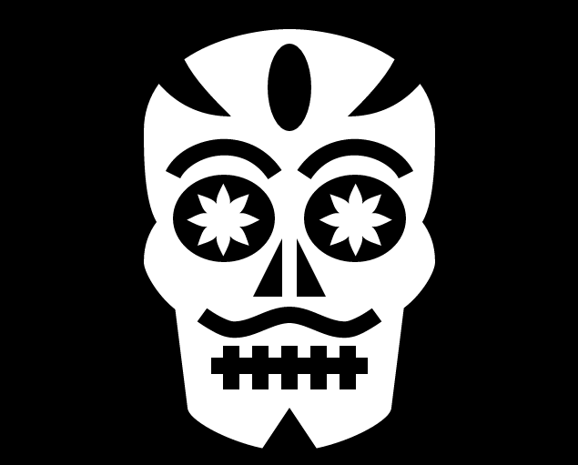

# GMTK 2022 Game Jam - Roll of the Dice

This year's theme is "Roll of the Dice". I made a puzzle game without any randomness.

My game is called: **"Dice de los muertos"**. Play it on [itch.io](https://honeymead.itch.io/dice-de-los-muertos).

**Controls**  
WASD or arrow keys to move.  
Space or CTRL to move the cam.  
R to restart the current level.  
Q or X to make the die transparent.  

## Attribution

Calavera icon by [Delapouite](https://delapouite.com/) under [CC BY 3.0](http://creativecommons.org/licenses/by/3.0/).  
Music "Morenita" by [TexasMusicForge](https://freesound.org/people/TexasMusicForge/sounds/2687/).  
